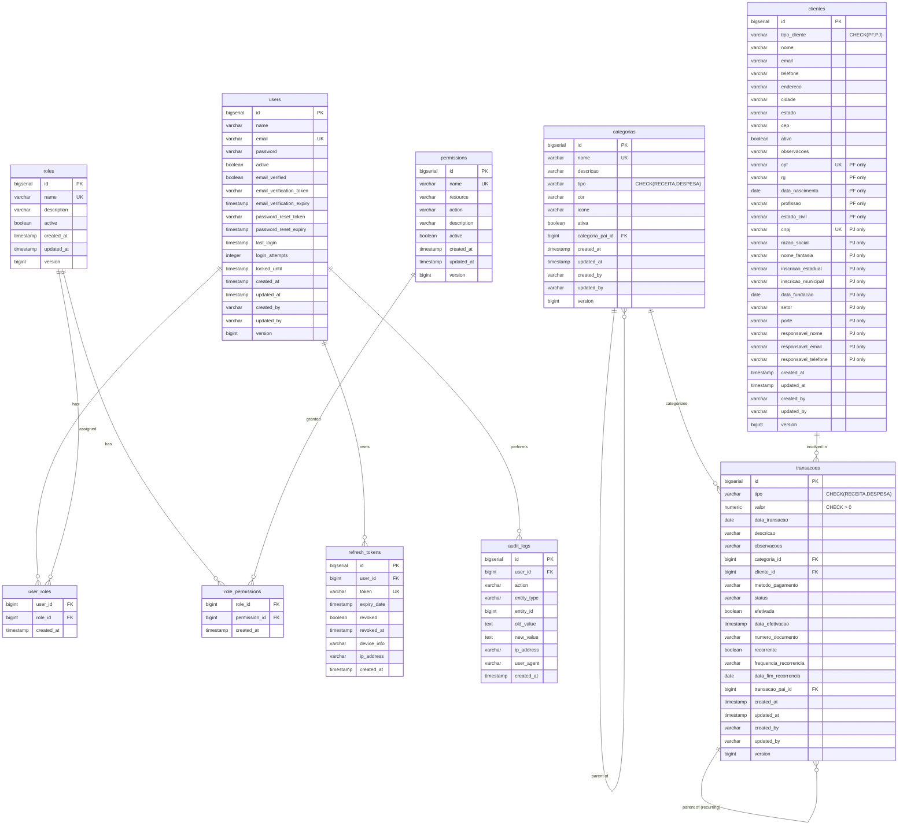
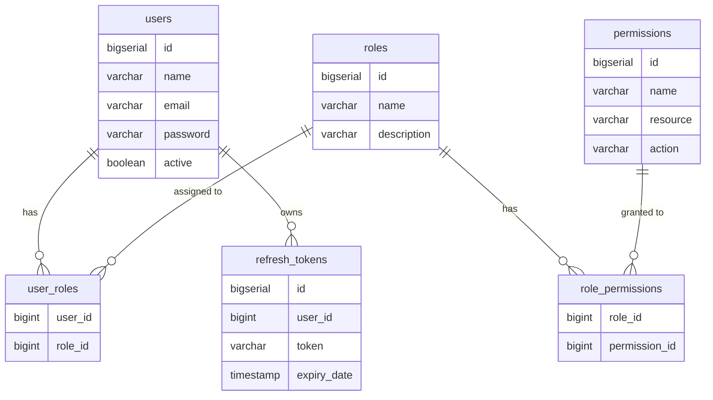
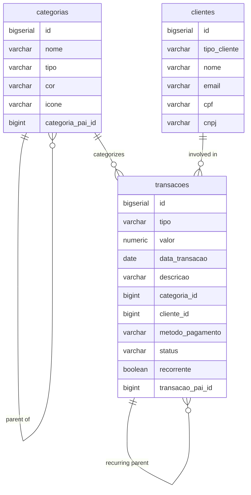
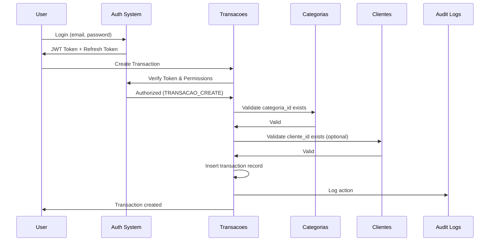
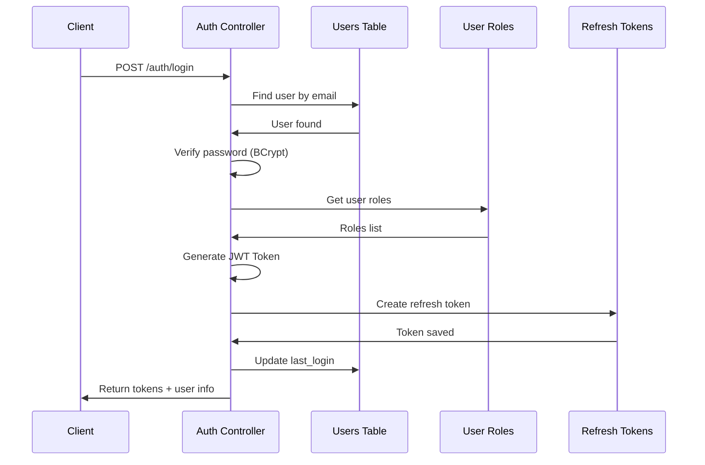

# Financial Assembly - Entity Relationship Diagram

## Full Database Schema



## Simplified View - Authentication



## Simplified View - Business Domain



## Relationship Details

### Users & Authentication

| Relationship | Type | Description |
|--------------|------|-------------|
| users → user_roles | 1:N | A user can have multiple roles |
| roles → user_roles | 1:N | A role can be assigned to multiple users |
| roles → role_permissions | 1:N | A role can have multiple permissions |
| permissions → role_permissions | 1:N | A permission can belong to multiple roles |
| users → refresh_tokens | 1:N | A user can have multiple refresh tokens |
| users → audit_logs | 1:N | A user can perform multiple actions |

**Key Points:**
- Many-to-many between users and roles (via user_roles)
- Many-to-many between roles and permissions (via role_permissions)
- Cascade delete on user_roles and role_permissions
- Set NULL on audit_logs.user_id to preserve audit trail

### Business Domain

| Relationship | Type | Description |
|--------------|------|-------------|
| categorias → categorias | 1:N | Self-referencing for category hierarchy |
| categorias → transacoes | 1:N | A category can have multiple transactions |
| clientes → transacoes | 1:N | A client can have multiple transactions |
| transacoes → transacoes | 1:N | Self-referencing for recurring transactions |

**Key Points:**
- Optional relationship between transacoes and clientes (nullable)
- Self-referencing relationships support unlimited nesting
- Foreign key constraints maintain referential integrity

## Inheritance Strategy

### Clientes Table - Single Table Inheritance

The `clientes` table uses Single Table Inheritance (STI) to store both Pessoa Física (PF) and Pessoa Jurídica (PJ):

```
clientes
├── tipo_cliente: 'PF' (discriminator)
│   ├── Common fields: nome, email, telefone, endereco...
│   └── PF-specific: cpf, rg, data_nascimento, profissao, estado_civil
│
└── tipo_cliente: 'PJ' (discriminator)
    ├── Common fields: nome, email, telefone, endereco...
    └── PJ-specific: cnpj, razao_social, nome_fantasia, setor, porte...
```

**Advantages:**
- Single table for all client types
- Easy to query all clients
- Foreign keys work seamlessly

**Constraints:**
- `tipo_cliente` CHECK ('PF', 'PJ')
- If PF, cpf must not be null
- If PJ, cnpj must not be null

## Indexes Overview

### Users & Auth Indexes
- `idx_user_email` on users(email)
- `idx_user_active` on users(active)
- `idx_refresh_token_token` on refresh_tokens(token)
- `idx_refresh_token_expiry` on refresh_tokens(expiry_date)

### Business Domain Indexes
- `idx_cliente_tipo` on clientes(tipo_cliente)
- `idx_cliente_cpf` on clientes(cpf) WHERE cpf IS NOT NULL
- `idx_cliente_cnpj` on clientes(cnpj) WHERE cnpj IS NOT NULL
- `idx_transacao_data` on transacoes(data_transacao DESC)
- `idx_transacao_tipo` on transacoes(tipo)
- `idx_categoria_tipo` on categorias(tipo)

### Composite Indexes
- `idx_transacao_data_tipo` on (data_transacao DESC, tipo)
- `idx_transacao_cliente_data` on (cliente_id, data_transacao DESC)
- `idx_transacao_categoria_data` on (categoria_id, data_transacao DESC)

## Security Model

### Role Hierarchy

```
ROLE_ADMIN (Full Access)
    ├── All permissions
    └── System administration

ROLE_MANAGER (Business Management)
    ├── CLIENTE: CREATE, READ, UPDATE, DELETE, LIST
    ├── TRANSACAO: CREATE, READ, UPDATE, DELETE, LIST, APPROVE, CANCEL
    ├── CATEGORIA: All operations
    └── REPORT: VIEW, EXPORT, CREATE

ROLE_USER (Standard User)
    ├── CLIENTE: CREATE, READ, UPDATE, LIST
    ├── TRANSACAO: CREATE, READ, UPDATE, LIST
    ├── CATEGORIA: READ, LIST
    └── REPORT: VIEW, EXPORT

ROLE_VIEWER (Read-Only)
    ├── All resources: READ, LIST, VIEW only
    └── No create, update, or delete permissions
```

### Permission Format

Permissions follow the pattern: `{RESOURCE}_{ACTION}`

**Resources:**
- CLIENTE
- TRANSACAO
- CATEGORIA
- USER
- REPORT
- SYSTEM

**Actions:**
- CREATE
- READ
- UPDATE
- DELETE
- LIST
- APPROVE (transacoes only)
- CANCEL (transacoes only)
- VIEW (reports)
- EXPORT (reports)
- SETTINGS (system)
- AUDIT (system)
- BACKUP (system)

## Data Flow Example

### Creating a Transaction



### User Authentication Flow



---

**Tools to View ERD:**
- GitHub (renders Mermaid automatically)
- VS Code (with Mermaid extension)
- Mermaid Live Editor: https://mermaid.live
- IntelliJ IDEA (with Mermaid plugin)

**Export Options:**
- Copy Mermaid code to https://mermaid.live
- Export as PNG, SVG, or PDF
- Use in documentation, presentations

---

**Last Updated:** 2025-10-16
**Schema Version:** V4
